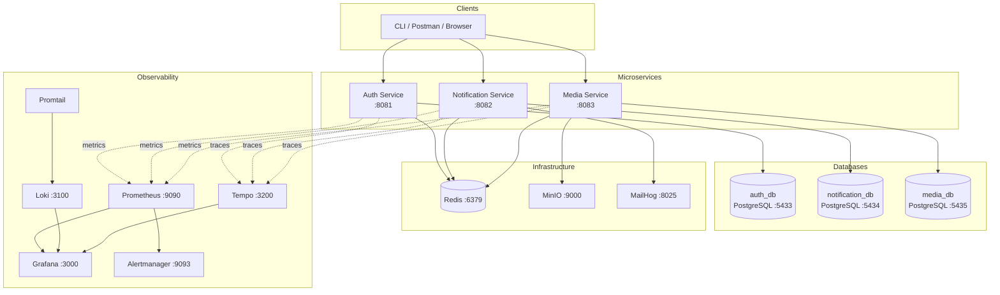

# Platform Infrastructure

Infrastructure stack for the Platform ecosystem.
Provides databases, caching, observability, alerting, and demo traffic generation.

---

## 🧱 Services

| Service | Purpose |
|---------|---------|
| PostgreSQL (x3) | Isolated database per microservice |
| Redis | Rate limiting + token support |
| MinIO | S3-compatible object storage |
| MailHog | Email testing (SMTP capture) |
| Prometheus | Metrics collection |
| Grafana | Dashboards |
| Loki | Log aggregation |
| Promtail | Log shipping |
| Tempo | Distributed tracing |
| Alertmanager | Alert routing |
| Demo Traffic | Synthetic load generation |

---

## 🧩 Architecture Overview

- All services run on a shared Docker network (`platform-net`)
- Each microservice exports metrics, logs, and traces
- Prometheus scrapes metrics from all services
- Loki ingests structured JSON logs via Promtail
- Tempo ingests distributed traces via OTLP
- Grafana provides unified observability across all signals



---

## 🐳 Running the Stack

```bash
docker compose up -d

# check running containers:
docker ps
```

---

## 🌐 Exposed Ports

| Service | Port |
|---------|------|
| Auth Service | 8081 |
| Notification Service | 8082 |
| Media Service | 8083 |
| PostgreSQL (Auth) | 5433 |
| PostgreSQL (Notification) | 5434 |
| PostgreSQL (Media) | 5435 |
| Redis | 6379 |
| MinIO API | 9000 |
| MinIO Console | 9001 |
| Prometheus | 9090 |
| Grafana | 3000 |
| Loki | 3100 |
| Tempo | 3200 |
| Alertmanager | 9093 |
| MailHog SMTP | 1025 |
| MailHog UI | 8025 |

---

## 📊 Grafana

- **URL:** http://localhost:3000
- **Username:** admin
- **Password:** admin

Pre-provisioned:
- Prometheus datasource
- Loki datasource
- Tempo datasource
- Dashboards for auth service

---

## 🧪 Demo Traffic

A lightweight Alpine container continuously hits:

- `/v1/health`
- `/actuator/health`

Used to:
- Generate metrics
- Populate logs
- Create traces
- Validate dashboards

---

## 🛠 Environment Variables

Loaded via `.env`:
- Database credentials
- Redis port
- JWT secret
- MinIO credentials
- Service configuration

---

## 🔁 Rebuilding Everything

To ensure a clean rebuild:

```bash
docker compose down -v
docker compose build --no-cache
docker compose up -d
```

---

## 📌 Status

- ✅ All databases healthy
- ✅ Redis healthy
- ✅ MinIO healthy
- ✅ Observability pipeline complete
- ✅ Alerts wired
- ✅ Demo traffic running
